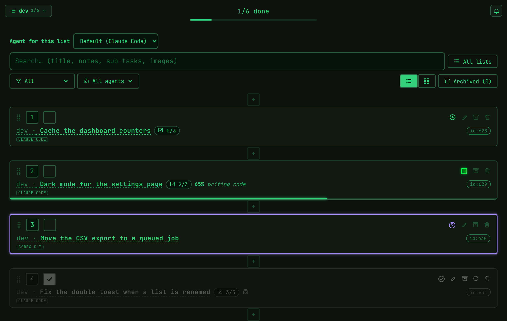
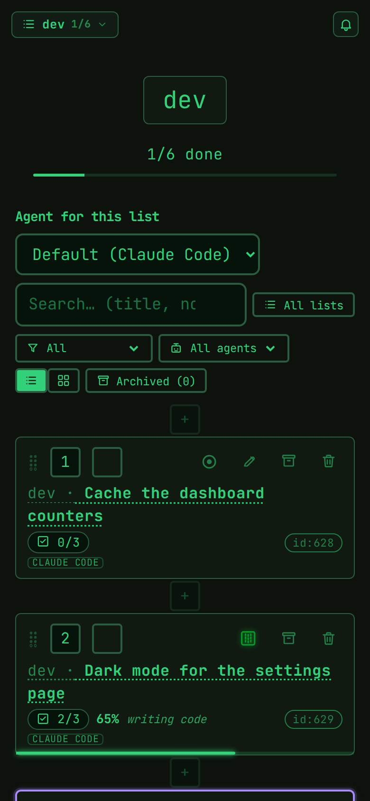

<p align="center">
  <picture>
    <source media="(prefers-color-scheme: dark)" srcset="public/images/brand/lockup-horizontal-dark.svg">
    
  </picture>
</p>

<p align="center">
  <a href="https://packagist.org/packages/alle80/griglia"></a>
  <a href="https://packagist.org/packages/alle80/griglia"></a>
  <a href="https://github.com/alle80/griglia/actions/workflows/tests.yml"></a>
  <a href="https://packagist.org/packages/alle80/griglia"></a>
  <a href="LICENSE"></a>
</p>

<h1 align="center">Griglia</h1>

<p align="center">
  A Laravel + Livewire task board where you queue work for your coding agent and watch it happen:<br>
  requests, questions, progress, results — in your own application, on your own database.
</p>

<p align="center">
  <a href="https://alle80.github.io/griglia/">Documentation</a> ·
  <a href="https://alle80.github.io/griglia/getting-started/quickstart/">Quickstart</a> ·
  <a href="docs/faq.md">FAQ</a> ·
  <a href="docs/glossary.md">Glossary</a> ·
  <a href="CHANGELOG.md">Changelog</a>
</p>

<p align="center">
  
</p>

## What it is

You write a request as a task — a title, a note, sub-tasks, a screenshot — and mark it **open to work**. A CLI
coding agent claims it, reports the phase it is in, asks when something is ambiguous, and closes it with a
result you can read. Nothing is hidden in a terminal you were not watching.

- **A flow you can see** — waiting → open to work → working → done, plus questions, pause, stop and resume.
  Every state is a dot on the row, and it moves live on every open device.
- **A CLI contract, not an integration** — `griglia:check` to read and act, `griglia:watch` to react. Any
  agent that can run an Artisan command and read a Markdown file works: Claude Code, Codex CLI, Gemini CLI, …
- **Several agents, several lists** — a default agent per list, an override per task, and a task claimed
  elsewhere is reported as busy instead of being taken twice.
- **Plans** — turn one goal into a chain of tasks, where closing one opens the next.
- **It reaches you** — an in-app bell, Web Push, mail, and live updates through any Laravel broadcaster.
- **It keeps the receipts** — working time measured by the board, tokens and cost reported by the agent,
  results and answered questions kept with the task.
- **Yours to look at** — installable themes, a settings page that tells the agent how to behave, and an
  instructions file assembled from switchable context blocks.

<p align="center">
  
</p>

## Requirements

- PHP 8.3 or later, Laravel 12 or 13, and Livewire 4.4 or later
- `ext-gd`, `ext-fileinfo` and `ext-zip`
- a login route and an authenticated user in the default `server` mode — without any authentication the host
  application answers `Route [login] not defined`; `GRIGLIA_MODE=local` removes the requirement on a trusted machine
- Tailwind CSS 4 only when choosing the optional `vite` asset mode

Optional integrations include `laravel/ai` for image descriptions, plans and transcription, and a Laravel
broadcaster such as Reverb for live updates.

## Install

From the root of the host Laravel application:

```bash
composer require alle80/griglia -W
php artisan migrate
```

`-W` allows Composer to resolve the Web Push dependency tree in a fresh Laravel application. The default
precompiled asset mode requires no Node build. Open `/` while authenticated: the board should load and create
the first list for the user.

For access gates, local mode, optional integrations, asset alternatives and a complete verification, follow
the [installation tutorial](docs/getting-started/installation.md). Then complete the
[quickstart](docs/getting-started/quickstart.md).

## Connect a coding agent

Publish the portable instructions from the host application root:

```bash
php artisan vendor:publish --tag=griglia-agents
```

Create or rename a list to match `GRIGLIA_AGENT_LIST` (`dev` by default), start the agent in the project
directory, and inspect the queue:

```bash
php artisan griglia:check
```

The board workflow is `waiting -> open to work -> working -> done`. The agent's first action is
`griglia:check --take=ID`; it uses `--ask=ID` to pause for an answer and `--done=ID` to return its result.
`griglia:watch` reports new work, answers and stop requests for interactive sessions. For unattended operation,
use the [persistent worker runbook](docs/agent/workers.md).

## Routes and access

The package registers `/`, `/plans`, `/plans/new`, `/settings`, `/context`, `/stats`, `/agents` and
`/dashboard` (a redirect to the board, kept for old links). The dashboard path is configurable and can be
disabled; without a home route it serves the board itself. In `server` mode, lists belong to the
authenticated user; restrict access with `canAccessGriglia()` or `GRIGLIA_ACCESS_GATE`. Administrative pages
use `canManageGriglia()`, `GRIGLIA_ADMIN_GATE` or `GRIGLIA_ADMINS`.

`GRIGLIA_MODE=local` removes authentication and makes lists global. Use it only on a trusted machine bound to
`127.0.0.1`; never expose local mode to a network.

See [access and modes](docs/configuration/access.md) for the complete contract and the generated
[configuration](docs/reference/config.md) and [settings](docs/reference/settings.md) references for exact keys.

## Front-end assets

Precompiled assets are the default and are published through Laravel's `laravel-assets` tag. If the host app
must compile the package with Tailwind/Vite, publish the config, set `GRIGLIA_ASSETS=vite`, import the package
CSS and JavaScript, and include package Blade files in Tailwind's sources. The canonical commands and trade-offs
are in [front-end assets](docs/getting-started/assets.md).

## Documentation

| | |
|---|---|
| [Documentation site](https://alle80.github.io/griglia/) | Everything below, in English and Italian |
| [Quickstart](docs/getting-started/quickstart.md) | The first five minutes after installing |
| [Using the board](docs/board/usage.md) | States, modal, filters, archive |
| [The agent side](docs/agent/index.md) | The command contract, workers, statistics |
| [Features](docs/features/index.md) | Plans, notifications, themes, AI |
| [Extending Griglia](docs/configuration/extending.md) | Views, strings and languages, themes and styles, events, access hooks |
| [Architecture](docs/architecture.md) | The task cycle, the tables, the seams — how the package is put together |
| [Roadmap](docs/roadmap.md) | What is coming, and what is out of scope by choice |
| [FAQ](docs/faq.md) · [Glossary](docs/glossary.md) | Short answers, and the words used here |
| [Upgrading](docs/operations/upgrading.md) · [Troubleshooting](docs/operations/troubleshooting.md) | When a version moves, and when something breaks |
| [Changelog](CHANGELOG.md) | What changed, version by version |
| [Versioning and releases](docs/contributing/releases.md) | What a `0.x` version promises, and how a release is cut |

## Contributing and support

```bash
composer install
composer lint
composer test
```

Tests use in-memory SQLite by default and include a guard against destructive execution on a live database.
Read [CONTRIBUTING.md](CONTRIBUTING.md) before opening a pull request — what a change must carry, how a bug
report is written and what happens after — and the [development
guide](docs/contributing/development.md) before running Testbench or MySQL tests.

Griglia is maintained by one person on personal time: what that means for issues, pull requests and
compatibility is written down in the [governance and support policy](GOVERNANCE.md). The project follows the
[Contributor Covenant 2.1](CODE_OF_CONDUCT.md) — direct reviews about the code, never about the person — and
security reports go through [SECURITY.md](SECURITY.md), not through public issues.

## Credits

Griglia is written and maintained by [Alessandro (alle80)](https://github.com/alle80), with the help of the
coding agents that use it every day — and it is developed on the board itself.

It stands on [Laravel](https://laravel.com), [Livewire](https://livewire.laravel.com),
[Tailwind CSS](https://tailwindcss.com), [spatie/laravel-settings](https://github.com/spatie/laravel-settings),
[laravel-notification-channels/webpush](https://github.com/laravel-notification-channels/webpush),
[league/commonmark](https://commonmark.thephpleague.com), [SortableJS](https://sortablejs.github.io/Sortable/)
and [Material for MkDocs](https://squidfunk.github.io/mkdocs-material/) for this documentation. Their
licenses, and what they cover, are listed in [license and third-party components](docs/contributing/license.md).

## License

Griglia is released under the [MIT license](LICENSE): use it, change it and ship it in a commercial product,
keeping the copyright notice. What that means in practice, which third-party licenses come with it and under
which terms contributions are accepted: [License](docs/contributing/license.md).
