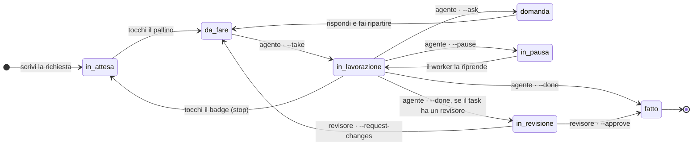

# Architettura

Come una richiesta viaggia da una riga della board fino all'agente e ritorno, e dove vive nel codice ogni
pezzo di quel viaggio. Da leggere prima di estendere il package, di rivedere una modifica o di cercare un
problema che succede «da qualche parte in mezzo».

## In una riga

Griglia è un package Laravel: **componenti Livewire** per la board, **modelli Eloquent** per i dati, un solo
**comando artisan** (`griglia:check`) come intero contratto con l'agente e un solo **evento broadcast**
(`TodoChanged`) che tiene allineati tutti gli schermi aperti. Non ha un server suo, non ha un worker di coda
suo, non ha API HTTP: gira dentro la tua applicazione, sul tuo database.

## Il ciclo

Un task è una piccola macchina a stati. La metà sinistra è tua, la metà destra è dell'agente, e nessuno dei
due può muovere le frecce dell'altro.



| Freccia | Chi la muove | Cosa cambia nella riga |
|---|---|---|
| in attesa → da fare | tu, sulla board | `open_to_work = true`; solo ora un agente può prenderlo |
| da fare → in lavorazione | l'agente, `--take` | `working = true`, `working_since` avvia il cronometro |
| in lavorazione → domanda | l'agente, `--ask` | una riga in `questions`, il task esce da `working` |
| domanda → da fare | tu, rispondendo nel modale | le risposte restano attaccate al task per sempre |
| in lavorazione → in pausa | l'agente, `--pause` | `paused = true`; percentuale e fase restano |
| in lavorazione → in attesa | tu, toccando il badge «in lavorazione» | viene scritto `stopped_at` — l'agente deve mollare il task |
| in lavorazione → fatto | l'agente, `--done` | `completed_at`, il commento di chiusura, le statistiche |
| in lavorazione → in revisione | l'agente, `--done` su un task con revisore | nasce un tentativo di revisione per il revisore |
| in revisione → fatto / da fare | il revisore, `--approve` / `--request-changes` | approvato chiude l'originale, le modifiche lo riaprono |

I pallini e le loro icone stanno in [Usare la board](board/usage.md#task-e-stati); le parole nel
[glossario](glossary.md).

Due regole tengono insieme tutto il resto:

- **L'agente non si apre il lavoro da solo.** Niente porta un task da «in attesa» a «da fare» tranne te.
- **La percentuale è un rapporto, non uno stato.** `--progress` e `--phase` scrivono due colonne e fanno
  broadcast; non spostano mai il task.

## I pezzi

| Cartella | Cosa ci vive |
|---|---|
| `src/Models/` | `Checklist`, `Todo`, `Ingredient` (sotto-task), `Question`, `Attachment`, `ContextGroup`, `ContextBlock` |
| `src/Livewire/` | la board (`TodoList`, `ThemedTodoList`), il modale del task (`IngredientModal`) e le pagine: impostazioni, contesto, piani, statistiche, agenti |
| `src/Console/` | il contratto con l'agente (`griglia:check`, `griglia:watch`) e i comandi di servizio (archivio, temi, skill, docs, immagini) |
| `src/Domain/` | `ReviewWorkflow` e i suoi enum — l'unico posto dove una revisione cambia mano |
| `src/Support/` | i servizi dietro i componenti: `Plan`, `Stats`, `Skills`, `Context`, `Notify`, `ImageStore`, `Speech`, `AgentStatus`, … |
| `src/Settings/` | i tre gruppi spatie/laravel-settings: `AgentSettings`, `OptimizationSettings`, `AppSettings` |
| `src/Events/` | `TodoChanged`, l'unico evento broadcast |
| `src/Http/` | cinque controller (allegati, push, service worker, asset dei temi, trascrizione) e la catena di middleware |
| `src/Notifications/` | campanella, Web Push e mail, inviate quando l'agente chiede o chiude |
| `src/Ai/` | le chiamate AI opzionali: piani da un prompt, descrizione delle immagini, trascrizione |
| radice di `src/` | `Agent`, `Admin`, `Mode`, `Themes`, `ThemeStore`, `GrigliaServiceProvider` |

`GrigliaServiceProvider` è la cucitura con l'applicazione che ospita il package: registra rotte, viste,
traduzioni, migrazioni, settings, comandi e i tag di publish. Tutto ciò che espone di proposito sta in
[Estendere Griglia](configuration/extending.md).

## I dati

Queste sono le tabelle create dalle migrazioni del package — quelle delle notifiche solo se la tua
applicazione non le ha già. `todos` porta la macchina a stati in colonne normali: non c'è nessuna stringa di
stato da tenere allineata.

| Tabella | Contiene | Note |
|---|---|---|
| `checklists` | le liste | `user_id` proprietario, `agent` agente di default, `plan_prompt` + `plan_paused` per i piani |
| `todos` | i task | stato, percentuale, agente, statistiche, catene — vedi sotto |
| `ingredients` | i sotto-task | nome storico, tenuto di proposito ([glossario](glossary.md)) |
| `questions` | le domande dell'agente | `question`, `answer`, `choices` opzionali |
| `attachments` | le immagini di un task | file su un disco privato, `description` scritta dall'AI e cercata dalla ricerca |
| `context_groups`, `context_blocks` | il file di istruzioni dell'agente, a pezzi | ciò che `griglia:context` scrive su disco |
| `settings` | i tre gruppi di impostazioni | una riga per chiave, `payload` in JSON |
| `notifications`, sottoscrizioni push | notifiche Laravel ed endpoint Web Push | create solo se la tua app non le ha già |

Le colonne di `todos` che contano, raggruppate per chi le scrive:

| Scritte da | Colonne |
|---|---|
| te | `title`, `notes`, `order`, `open_to_work`, `stopped_at`, `archived_at`, `skills` |
| l'agente | `working`, `paused`, `progress`, `phase`, `question`, `completed`, `claude_comment`, `result_summary`, `outcome`, `tokens_in`, `tokens_out` |
| la board | `working_since`, `completed_at`, `result_seen`, `review_status`, `review_outcome` |

Tre chiavi esterne puntano ad altri task e danno alla board le sue tre catene:

| Colonna | Catena | Dove è spiegata |
|---|---|---|
| `depends_on_id` | un piano: chiudere un task apre il successivo | [Piani](features/plans.md) |
| `parent_id` | un task ripreso resta legato a quello che continua | [Usare la board](board/usage.md) |
| `review_of_id` | un tentativo di revisione e il task che rivede | [`--approve` / `--request-changes`](reference/commands.md) |

`notes` è tua e `claude_comment` è dell'agente: l'agente scrive il risultato nel proprio campo e non tocca
mai il tuo.

## Il percorso di una richiesta

Ogni pagina della board passa dalla stessa catena di middleware, configurata in `config/griglia.php`:

```text
web (o il tuo `middleware`) → GrigliaAccess → SetLocale → RememberStyle → OpenFromLink → componente Livewire
```

- `GrigliaAccess` sostituisce `auth` nelle rotte del package: in modalità `server` richiede un utente
  autenticato e l'hook `canAccessGriglia()`; in modalità `local` fa passare chiunque e le liste diventano
  globali.
- `GrigliaAdmin` protegge solo `/settings` e `/context`.
- `SetLocale` applica la lingua della board, `RememberStyle` ricorda lo stile della lista che stavi
  guardando, `OpenFromLink` apre un task direttamente dal link di una notifica.

Modalità e cancelli sono descritti in [Accessi, amministratori e modalità](configuration/access.md).

## Aggiornamenti dal vivo

Ogni modifica a un task, sotto-task, domanda o allegato fa broadcast di un solo evento `TodoChanged` sul
canale privato del proprietario (modalità `server`) o su un unico canale pubblico (modalità `local`). Le
board aperte aggiornano la riga, il toast compare solo per le modifiche arrivate dalla console e senza un
broadcaster configurato non si rompe niente: l'evento viene semplicemente lasciato cadere. Payload e
listener stanno in [Eventi e broadcasting](reference/events.md).

Il lato agente dello stesso segnale è `griglia:watch`, che stampa quegli eventi sul terminale: così un
worker può reagire senza fare polling.

## Dove si configura il comportamento

Due livelli, di proposito:

| Livello | Lo cambia | Contiene |
|---|---|---|
| `config/griglia.php` (+ `.env`) | chi installa il package | il cablaggio: rotte, modalità, agenti, dischi, asset, rate limit — vedi la [reference della configurazione](reference/config.md) |
| Le impostazioni, nel database | tu, da `/settings` | il comportamento: come lavora l'agente, notifiche, ottimizzazione, i default della board — vedi la [reference delle impostazioni](reference/settings.md) |

La regola pratica: se per cambiarlo serve un deploy è configurazione; se potresti volerlo cambiare dal
telefono è un'impostazione. `griglia:check` stampa in testa le impostazioni dell'agente e quelle di
ottimizzazione, così l'agente le legge all'inizio di ogni sessione.

## Cosa non c'è, di proposito

Il contratto con l'agente è **artisan più un worker**, e nient'altro: niente API HTTP, niente token macchina,
niente webhook, niente server MCP, nessuna chiamata in uscita a parte quelle AI opzionali che configuri tu.
Chi esegue il comando ha già una shell sull'host e le credenziali del database: aggiungere una seconda porta,
più debole, allargherebbe soltanto la superficie.

Le conseguenze di questa scelta, e le altre strade non prese, stanno nella [roadmap](roadmap.md).

## Vedi anche

- [Il lato agente](agent/index.md) — i comandi che muovono la macchina a stati.
- [Estendere Griglia](configuration/extending.md) — le cuciture fatte apposta per essere usate da fuori.
- [Sviluppo](contributing/development.md) — come far girare il package e i suoi test in locale.
- [Roadmap](roadmap.md) — cosa arriva e cosa resta fuori per scelta.
