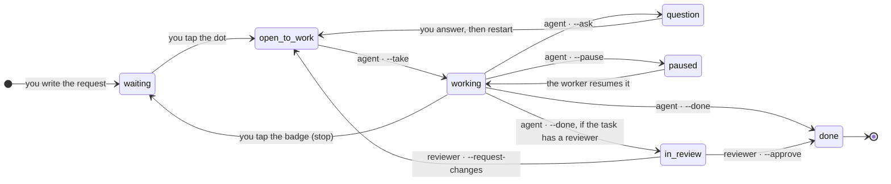

# Architecture

How a request travels from a row on the board to an agent and back, and where each piece of that journey
lives in the code. Read this before extending the package, reviewing a change, or debugging something that
happens "somewhere in the middle".

## The one-line version

Griglia is a Laravel package: **Livewire components** for the board, **Eloquent models** for the data, one
**Artisan command** (`griglia:check`) as the entire agent contract, and one **broadcast event**
(`TodoChanged`) that keeps every open screen in sync. There is no server of its own, no queue worker of its
own, no HTTP API: it runs inside your application, on your database.

## The cycle

A task is a small state machine. You own the left half, the agent owns the right half, and neither can move
the other's arrows.



| Arrow | Who moves it | What changes in the row |
|---|---|---|
| waiting → open to work | you, on the board | `open_to_work = true`; only now may an agent claim it |
| open to work → working | the agent, `--take` | `working = true`, `working_since` starts the clock |
| working → question | the agent, `--ask` | a row in `questions`, the task leaves `working` |
| question → open to work | you, answering in the modal | the answers stay attached to the task forever |
| working → paused | the agent, `--pause` | `paused = true`; progress and phase are kept |
| working → waiting | you, tapping the working badge | `stopped_at` is set — the agent must drop the task |
| working → done | the agent, `--done` | `completed_at`, the closing comment, the statistics |
| working → in review | the agent, `--done` on a task with a reviewer | a review attempt is created for the reviewer |
| in review → done / open to work | the reviewer, `--approve` / `--request-changes` | approved closes the original, changes reopen it |

The dots and their icons are in [Using the board](board/usage.md#tasks-and-states); the words are in the
[glossary](glossary.md).

Two rules hold the whole thing together:

- **The agent never opens work for itself.** Nothing turns a waiting task into an open one except you.
- **Progress is a report, not a state.** `--progress` and `--phase` write two columns and broadcast; they
  never move the task.

## The pieces

| Directory | What lives there |
|---|---|
| `src/Models/` | `Checklist`, `Todo`, `Ingredient` (sub-task), `Question`, `Attachment`, `ContextGroup`, `ContextBlock` |
| `src/Livewire/` | the board (`TodoList`, `ThemedTodoList`), the task modal (`IngredientModal`), and the pages: settings, context, plans, stats, agents |
| `src/Console/` | the agent contract (`griglia:check`, `griglia:watch`) and the maintenance commands (archive, themes, skills, docs, images) |
| `src/Domain/` | `ReviewWorkflow` and its enums — the only place a review changes hands |
| `src/Support/` | services behind the components: `Plan`, `Stats`, `Skills`, `Context`, `Notify`, `ImageStore`, `Speech`, `AgentStatus`, … |
| `src/Settings/` | the three spatie/laravel-settings groups: `AgentSettings`, `OptimizationSettings`, `AppSettings` |
| `src/Events/` | `TodoChanged`, the single broadcast event |
| `src/Http/` | five controllers (attachments, push, service worker, theme assets, transcription) and the middleware chain |
| `src/Notifications/` | bell, Web Push and mail notifications sent when the agent asks or finishes |
| `src/Ai/` | the optional AI calls: plans from a prompt, image descriptions, transcription |
| root of `src/` | `Agent`, `Admin`, `Mode`, `Themes`, `ThemeStore`, `GrigliaServiceProvider` |

`GrigliaServiceProvider` is the seam with the host application: it registers routes, views, translations,
migrations, settings, commands and the publish tags. Everything it exposes on purpose is in
[Extending Griglia](configuration/extending.md).

## The data

These are the tables the package migrations create — the notification ones only if your application has
none. `todos` carries the state machine in plain columns: there is no status string to keep in sync.

| Table | Holds | Notes |
|---|---|---|
| `checklists` | lists | `user_id` owner, `agent` default agent, `plan_prompt` + `plan_paused` for plans |
| `todos` | tasks | state, progress, agent, statistics, chains — see below |
| `ingredients` | sub-tasks | historical name, kept on purpose ([glossary](glossary.md)) |
| `questions` | agent questions | `question`, `answer`, optional `choices` |
| `attachments` | images on a task | file on a private disk, `description` filled by the AI and searched |
| `context_groups`, `context_blocks` | the agent instruction file, in pieces | what `griglia:context` writes out |
| `settings` | the three settings groups | one row per key, `payload` as JSON |
| `notifications`, push subscriptions | Laravel notifications and Web Push endpoints | created only if your app has none |

The columns of `todos` that matter, grouped by who writes them:

| Written by | Columns |
|---|---|
| you | `title`, `notes`, `order`, `open_to_work`, `stopped_at`, `archived_at`, `skills` |
| the agent | `working`, `paused`, `progress`, `phase`, `question`, `completed`, `claude_comment`, `result_summary`, `outcome`, `tokens_in`, `tokens_out` |
| the board | `working_since`, `completed_at`, `result_seen`, `review_status`, `review_outcome` |

Three foreign keys point at other tasks and give the board its three chains:

| Column | Chain | Where it comes from |
|---|---|---|
| `depends_on_id` | a plan: closing a task opens the next one | [Plans](features/plans.md) |
| `parent_id` | a resumed task keeps a link to the one it carries on from | [Using the board](board/usage.md#carrying-on-after-a-task-is-done) |
| `review_of_id` | a review attempt and the task it reviews | [`--approve` / `--request-changes`](reference/commands.md) |

`notes` belongs to you and `claude_comment` to the agent: the agent writes its result in its own field and
never touches yours.

## The request path

Every page of the board goes through the same middleware chain, configured in `config/griglia.php`:

```text
web (or your `middleware`) → GrigliaAccess → SetLocale → RememberStyle → OpenFromLink → Livewire component
```

- `GrigliaAccess` replaces `auth` in the package routes: in `server` mode it requires a logged-in user and
  the `canAccessGriglia()` hook; in `local` mode it lets everybody in and the lists become global.
- `GrigliaAdmin` guards `/settings` and `/context` only.
- `SetLocale` applies the board language, `RememberStyle` remembers the style of the list you were looking
  at, `OpenFromLink` opens a task straight from a notification link.

Modes and gates are described in [Access, administrators and modes](configuration/access.md).

## Live updates

Any change to a todo, sub-task, question or attachment broadcasts one `TodoChanged` event on the owner's
private channel (`server`) or on a single public channel (`local`). Open boards refresh the row, the toast
appears only for changes that came from the console, and with no broadcaster configured nothing breaks —
the event is simply dropped. The payload and the listeners are in
[Events and broadcasting](reference/events.md).

The agent side of the same signal is `griglia:watch`, which prints those events on the terminal so a worker
can react without polling.

## Where behaviour is configured

Two layers, on purpose:

| Layer | Changed by | Holds |
|---|---|---|
| `config/griglia.php` (+ `.env`) | whoever installs the package | wiring: routes, mode, agents, disks, assets, rate limits — see the [config reference](reference/config.md) |
| Settings, in the database | you, on `/settings` | behaviour: how the agent works, notifications, optimization, the board's own defaults — see the [settings reference](reference/settings.md) |

The rule of thumb: if changing it requires a deploy it is config; if you may want to change it from your
phone it is a setting. `griglia:check` prints the agent and optimization settings at the top of its output,
so the agent reads them at the beginning of every session.

## What is deliberately not here

The contract with the agent is **Artisan plus a worker**, nothing else: no HTTP API, no machine tokens, no
webhooks, no MCP server, no outgoing calls except the optional AI ones you configure. Anything that runs the
command already has a shell on the host and the database credentials — adding a second, weaker door would
only widen the surface.

The consequences of that choice, and the other roads not taken, are on the [roadmap](roadmap.md).

## See also

- [The agent side](agent/index.md) — the commands that move the state machine.
- [Extending Griglia](configuration/extending.md) — the seams meant to be used from outside.
- [Development](contributing/development.md) — how to run the package and its tests locally.
- [Roadmap](roadmap.md) — what is coming, and what is out of scope by choice.
